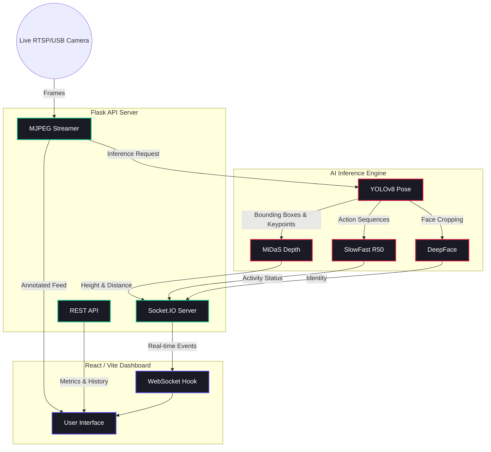

# SecureVision AI 🛡️


> A full-stack, enterprise-grade intelligent surveillance system built from scratch with 5 deep learning models working in concert.

[](https://dist-alpha-ten-64.vercel.app)
[](https://reactjs.org/)
[](https://flask.palletsprojects.com/)
[](https://opencv.org/)

SecureVision replaces legacy security cameras with an AI-driven pipeline capable of real-time pose estimation, precision height measurement, activity recognition, and face identification. 

---

## 🔗 Live Demo
Check out the fully interactive portfolio and mock-data demo dashboard here:
**[SecureVision Live Demo](https://dist-alpha-ten-64.vercel.app)**

---

## ✨ Features

- **🚶‍♂️ Real-time Activity Recognition**: Utilizes SlowFast R50 to detect complex human behaviors (walking, running, falling, loitering).
- **📏 Precision Height Measurement**: Fuses YOLOv8-Pose with MiDaS depth mapping for highly accurate human height estimation.
- **🧑 Face Identification**: Integrates DeepFace and RetinaFace for seamless personnel recognition.
- **📊 Real-time Dashboard**: A stunning, hardware-accelerated Vite/React dashboard for live monitoring.
- **🛡️ Risk Scoring**: Automated, programmable threat assessment logic based on posture and activity.

---

## 🏗️ System Architecture

SecureVision operates on a decoupled microservices architecture, utilizing WebSockets and MJPEG streams for ultra-low latency inference visualization.



---

## 🚀 Getting Started

### Prerequisites
- Python 3.9+
- Node.js 18+
- (Optional) Docker

### 1. Start the Backend
The backend runs the complete ML pipeline via Flask.
```bash
cd backend
python -m venv venv
venv\Scripts\activate  # Windows
pip install -r requirements.txt

# Start the Flask server
python app.py
```

### 2. Start the Frontend
The frontend is a modern React/Vite SPA.
```bash
cd dashboard
npm install

# Start the development server
npm run dev
```

### 3. All-in-One Launcher (Windows)
Simply run the provided batch script to launch both services simultaneously:
```cmd
run.bat
```

---

## 📸 Screenshots

### Live Monitoring Dashboard


### Analytics & Events Panel


---

## 🛠️ Technology Stack

- **Frontend**: React 18, Vite, React Router, Recharts, Framer Motion
- **Backend**: Python, Flask, Flask-SocketIO, Waitress
- **AI/ML**: PyTorch, YOLOv8, MiDaS v3, SlowFast, DeepFace
- **Communication**: WebSockets (Socket.IO), MJPEG Streaming

---

## 📄 License
This project is proprietary. All rights reserved.
