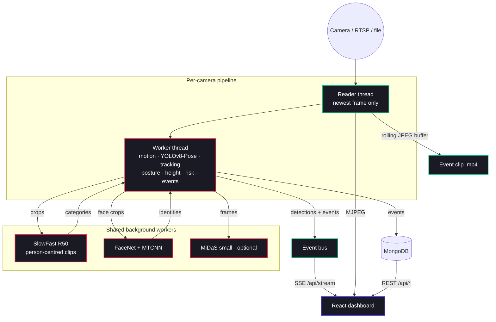

# SecureVision AI 🛡️


> A full-stack surveillance system: pose and posture, activity recognition, calibrated height measurement and face identification, with one real-time pipeline per camera and a live React dashboard.

[](https://dist-alpha-ten-64.vercel.app)
[](https://reactjs.org/)
[](https://flask.palletsprojects.com/)
[](https://pytorch.org/)

---

## 🔗 Live Demo
**[SecureVision Live Demo](https://dist-alpha-ten-64.vercel.app)** is the dashboard running on **simulated data**; no backend is connected, and a banner says so.

---

## ✨ Features

- **🚶 Posture from pose.** YOLOv8-Pose keypoints are tracked per person and classified as walking, running, falling, lying down, fighting, kicking, crouching and more. Speeds are measured in body-heights per second, so thresholds hold at any resolution or frame rate. Alarming postures must persist before they count.
- **🏃 Activity recognition.** SlowFast R50 runs on person-centred clips sampled over a fixed 2.1 s window. Its 400 Kinetics classes are reduced to a few categories with a clear CCTV meaning: fighting, falls, running, climbing and spray painting.
- **⏱ Loitering.** Dwell time per tracked person (passing, visitor, lingering, loitering at 60 s, configurable).
- **📏 Height measurement.** Uses ground-plane geometry. You calibrate each camera once with a person of known height; after that, everyone is measured independently. The calibration reports its own leave-one-out error.
- **🧑 Face identification.** FaceNet (VGGFace2) embeddings with MTCNN detection and multi-sample enrollment. Every enrollment records the model that produced it, so switching models can never silently mis-match people.
- **🎥 Overlays on the live video.** Boxes, skeletons, walking trails, identity, posture, dwell time and the risk badge are drawn on the stream itself, so the picture shows the same judgement as the events list. Recorded clips stay clean.
- **⏺ A clip per event.** Each alert saves an MP4 covering the seconds before and after it, not just a still. Old clips are pruned by age and total size.
- **🔒 Password-protected by default.** The API, camera streams, live event stream and enrollment all require a session. A password is generated on first run if you don't set one.
- **🛡️ Explainable risk.** Each alert lists the reasons behind its score, e.g. "loitering 75s", "person falling", "unrecognised face". Falls, fights and new loitering raise an event immediately.
- **📷 Multi-camera.** USB, IP and RTSP sources. Each camera runs one pipeline whether or not anyone is watching, and cameras persist across restarts.
- **👣 Identity that survives crossings.** Tracks are matched with motion prediction plus a torso-appearance model, and appearance is never learned while two people overlap (that crop contains both). Dwell time and the recognised name live on the track, so keeping identities stable keeps loitering honest.
- **⚡ Live dashboard.** Detections and alerts are pushed over Server-Sent Events (SSE), with polling as a fallback. Throughput and latency are measured continuously and shown on the Analytics page.
- **🔍 Optional depth.** MiDaS gives a relative near/far ranking (`ENABLE_DEPTH=1`). Metric distance comes from the calibrated geometry.

---

## 🏗️ Architecture



---

## 📊 Benchmarks

Measured with `backend/eval/bench_models.py` and `backend/eval/bench_live.py` (see [backend/eval/README.md](backend/eval/README.md)).

**Hardware:**
- Intel Core i7-13620H (10 cores / 16 threads), 23.6 GB RAM
- NVIDIA GeForce RTX 5050 Laptop GPU (8 GB)
- Windows 11, *Balanced* power plan, on AC power
- PyTorch 2.7.1 + CUDA 12.8

**Input:** `test_video.mp4`, 640×360 at 12 fps, an overhead parking-lot view of one pedestrian and one cyclist.

### Per model (isolated, warm)

| Model | GPU mean (p95) | CPU mean (p95) |
|---|---|---|
| YOLOv8n-Pose, 640 px, every frame | 14.5 ms (23.7) | 82.9 ms (96.5) |
| SlowFast R50, one 32-frame clip | 38.2 ms (39.2) | 1,120 ms (1,249) |
| MiDaS small | 13.7 ms (19.3) | 83.8 ms (90.8) |
| Face detection + embedding, 320 px crop | 103–195 ms across runs | 116–141 ms across runs |

Timings vary noticeably between runs on this laptop. A cold GPU was about 3× slower than the warm numbers above (YOLO 47 ms in the first run).

### Live pipeline (12 fps source, 90 s windows)

"Camera → browser" is measured by an SSE client from each frame's capture timestamp to the moment the browser-side client receives the detection.

| Configuration | Frames processed | Frame → result p50 / p95 | Camera → browser p50 / p95 |
|---|---|---|---|
| GPU, pose + tracking (2 runs) | 99% (11.4–11.6 of 11.7 fps) | 56–62 / 101–136 ms | 60–63 / 131–159 ms |
| GPU, **all five networks** (depth on, activity forced on) | 99% (11.4 of 11.7 fps) | 65 / 153 ms | 50 / 131 ms |
| CPU, pose + tracking | 38% (4.5 of 11.7 fps) | 264 / 464 ms | 315 / 496 ms |
| CPU, **all five networks** | 69% (7.2 of 11.4 fps) | 146 / 486 ms | 150 / 464 ms |

**Maximum throughput** (source unthrottled, per-frame path):
- **GPU:** 48.4 fps, 21 ms frame → result (median).
- **CPU:** 11.9 fps, 84 ms frame → result (median).

**Frame → event stored:**
- **GPU:** 52–121 ms mean.
- **CPU:** 91–285 ms mean.
- These use only 1–6 events per run.

In the real-time runs, detection took 52–59 ms on the GPU, against 19 ms at full load. On the *Balanced* power plan, the GPU and CPU slow down between frames when the load is light. That is also why the CPU "all five networks" run processed more frames than the lighter CPU run. Compare power modes before quoting numbers.

**Frames tested:**
- **Live runs:** 6,075 frames processed; the 647-frame clip loops.
- **Per-model runs:** 750 detection frames, 90 SlowFast clips, 90 MiDaS frames and 330 face crops.

**Before the 2.0 rewrite** (same laptop): CPU-only PyTorch, 8.7 of 11.8 fps processed and 155 ms frame → result (median). Events reached the dashboard only on its 2-second poll, which adds about 1 s on average by estimate; this wasn't measured.

### Live stream delivery

Measured against the running backend over the same demo video, with overlays and
clip recording on:

| | |
|---|---|
| Camera → browser (live stream) | **29 ms median, 34 ms p95** |
| Update rate to the dashboard | 11.5 messages/s (the pipeline's full rate) |
| Pipeline with overlays on | 11.8 of 11.8 fps — overlays cost nothing measurable |
| MJPEG video | ~171 KB/s at 11.9 fps |

The production server needs one setting to stream promptly. Measured
camera → browser latency by waitress `send_bytes`: **1 → 29 ms**, 4096 → 1.4 s,
18000 (waitress default) → 6.3 s, with no effect on video throughput. The app
defaults to 1; override with `SERVER_SEND_BYTES`.

### Pose model size: measured, not assumed

`eval/compare_pose_models.py` on the test clip (647 frames, RTX 5050):

| Model | mean ms | frames with a person | detection conf. | keypoint conf. |
|---|---|---|---|---|
| **yolov8n-pose** (default) | 12.1 | **76** | 0.762 | **0.820** |
| yolov8s-pose | 12.1 | 66 | 0.772 | 0.778 |
| yolov8m-pose | 14.9 | 68 | **0.799** | 0.711 |

On this footage the bigger models are **not** an upgrade: they find the small,
overhead subjects less often and their keypoints — which posture and height
measurement depend on — are less confident. The default stays nano. Your camera
may differ, so measure yours: `python eval/compare_pose_models.py --video yours.mp4`,
then set `POSE_MODEL`.

### Accuracy: not measured yet

No accuracy figure is claimed here, because none has been measured on labelled data. The kit measures each one on your own footage:

| Metric | Command | You record |
|---|---|---|
| Height error (± cm) | `python eval/eval_height.py manifest.json` | a reference person + ≥5 people of known height |
| Face ID accuracy, TAR / FAR | `python eval/eval_faces.py probes/` | new photos of enrolled people + strangers |
| Activity precision / recall per class | `python eval/eval_activity.py clips/` | ≥20 labelled clips per class |

SlowFast was trained on Kinetics (YouTube, mostly eye-level). On overhead CCTV it can misfire: on the test clip it gave "drop kicking" a probability of 0.48 for someone walking. The alert thresholds are set with that in mind. Measure on your own footage, with and without SlowFast (`--no-slowfast`).

---

## 🚀 Getting Started

📖 **[Step-by-step setup: HOW_TO_RUN.md](HOW_TO_RUN.md)**

### Quick start (Windows)
```cmd
install.bat   :: once: backend venv (CUDA PyTorch if you have an NVIDIA GPU) + dashboard
run.bat
```

### Configuration
| Variable | Default | |
|---|---|---|
| `CAMERA_SOURCE` | `0` | device index or stream URL for the default camera |
| `DEMO_MODE`, `DEMO_VIDEO`, `DEMO_FPS` | off | loop a video file instead of a camera (`DEMO_FPS=0`: as fast as possible) |
| `MONGO_URI`, `MONGO_DB` | `mongodb://localhost:27017/`, `security_system` | |
| `FACE_BACKEND` | `facenet` | `facenet`, `deepface` or `none`. Changing it requires re-enrolling everyone |
| `ENABLE_ACTIVITY` / `ENABLE_DEPTH` | `1` / `0` | SlowFast / MiDaS |
| `ACTIVITY_MIN_PERSON_PX` | `100` | smaller people are skipped by SlowFast |
| `LOITER_SECONDS` | `60` | |
| `CONF_THRESHOLD`, `ALERT_COOLDOWN_S` | `0.5`, `5` | also editable in *Settings* |
| `POSE_MODEL` | `yolov8n-pose.pt` | see the comparison above before changing |
| `DASHBOARD_PASSWORD` | generated on first run | printed once, stored in `backend/.secrets/` |
| `AUTH_DISABLED` | `0` | `1` removes the password gate entirely |
| `OVERLAYS` | `1` | draw boxes/skeletons on the live stream |
| `ENABLE_CLIPS`, `CLIP_PRE_S`, `CLIP_POST_S` | `1`, `4`, `4` | event video recording |
| `CLIP_MAX_AGE_DAYS`, `CLIP_MAX_TOTAL_MB` | `30`, `2048` | clip retention |
| `FLASK_DEV`, `SERVER_THREADS`, `SERVER_SEND_BYTES` | `0`, `24`, `1` | server tuning |

### Height calibration
*Settings → Height calibration*:
1. Enter the height of a person standing fully in view, then press **Record sample**.
2. Repeat at three or more distances from the camera.
3. Press **Calibrate**.

The card shows the fitted camera height and tilt and the leave-one-out error. Until a camera is calibrated, the dashboard shows "camera not calibrated" instead of a height.

### Security and privacy
This system stores images of identifiable people and face embeddings, so:

- **Everything is behind a password** except `/api/health` and the login route —
  including camera streams and the live event stream. On first run a password is
  generated, printed to the console and saved in `backend/.secrets/` (gitignored).
  Set `DASHBOARD_PASSWORD` to choose your own; `AUTH_DISABLED=1` turns the gate off.
- **Event screenshots and clips are no longer tracked by git.** 512 screenshots of
  real people were previously committed; they are now untracked and ignored.
  They remain in the repository's *history*, which only rewriting history removes.
- **Face embeddings are stored unencrypted in MongoDB.** Protect the database if the
  host is shared, and keep the enrolled-user backups in `backend/backups/` private.

### Tests and CI
```bash
cd backend && venv\Scripts\python -m pytest -q
```
GitHub Actions runs the backend tests and the dashboard lint and build on every
push and pull request (`.github/workflows/ci.yml`).

---

## 📸 Screenshots

### Live Monitoring Dashboard


### Analytics & Events Panel


*(Screenshots are from before the 2.0 dashboard changes.)*

---

## 🛠️ Technology Stack

- **Frontend:** React 19, Vite, React Router, Chart.js, Server-Sent Events
- **Backend:** Python, Flask behind waitress, MongoDB
- **AI/ML:** PyTorch 2.7 (CUDA 12.8), YOLOv8n-Pose, SlowFast R50, FaceNet + MTCNN, MiDaS small

---

## 📄 License
This project is proprietary. All rights reserved.
